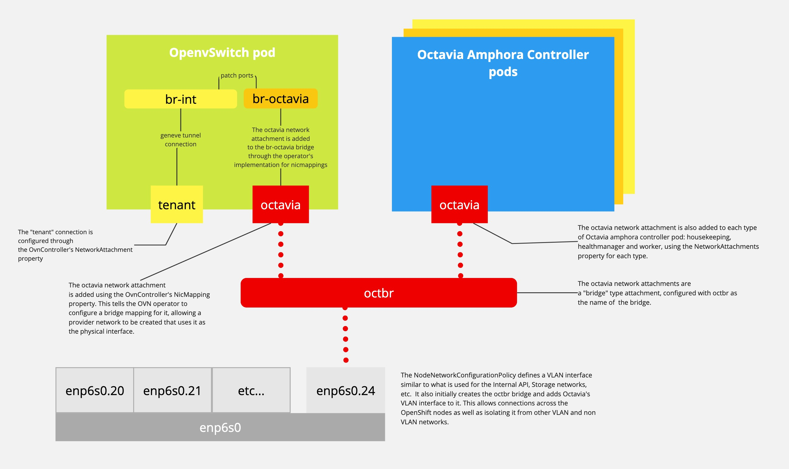

# The Octavia Amphora Management Network

The Octavia Amphora controller pods require network connectivity across the
OpenStack cloud in order to monitor and manage amphora Load Balancer VMs . This
document describes the elements that implement the management network.

The _Octavia management network_ is actually two OpenStack networks: a tenant
network that is connected to the amphora VMs; and a provider network connecting
Amphora controllers running in the podified control plane through a network
defined by a kubernetes network attachment. An OpenStack router routes packets
between the two with both the control plane pods and load balancer VMs having
routes configured to direct traffic through the router for those networks.

## Configuring Octavia's Control Plane Networking



## How To Add Octavia to an existing deployment

Adding Octavia to an existing deployment requires a L2 connection between
OpenShift worker nodes hosting the amphora controller pods and a network
attachment to give pods access to that connection as well as allow connections
between pods on a worker node. The former is configured through the
`NodeNetworkConfigurationPolicy` custom resource and the latter through a
`NetworkAttachmentDefinition` custom resource. The following provides examples
of what these CR modifications might look like. Please note the actual values
for things like `base-iface` and appropriate network IP ranges may vary
depending on hardware configuration or local networking policies, etc..

### Add the octavia interfaces to each NodeNetworkConfigurationPolicy.

This example assumes that the interface **enp6s0** is being used as the base
interface for the VLAN interfaces configured for network isolation on your
OpenShift nodes.

The vlan interface is added as a port to the `octbr` bridge to allow pods
 connected to `octavia` network attachment to communicate with pods running on
other worker nodes. As it is a VLAN interfaces, it also provides desirable
isolation from other networks that might share the same base interface or the
physical medium that the base interface is connected to.

```sh
oc get -n openstack --no-headers nncp | cut -f 1 -d ' ' | while read ; do
    oc patch -n openstack nncp $REPLY --type=merge --patch '
    spec:
      desiredState:
        interfaces:
        - description: Octavia vlan host interface
          name: enp6s0.24
          state: up
          type: vlan
          vlan:
            base-iface: enp6s0
            id: 24
        - bridge:
            options:
              stp:
                enabled: false
            port:
            - name: enp6s0.24
          description: Configuring bridge octbr
          mtu: 1500
          name: octbr
          state: up
          type: linux-bridge
    '
done
```

### Add the octavia network attachment definition for the Octavia management network.

The `octavia` network attachment is needed to connect pods that manage amphorae
and the OpenvSwitch pods (managed by the OVN operator). OpenStack uses the
podified OpenvSwitch instance to implement the route between the management
network's provider and tenant networks. This attachment must be a bridgeable
interface in the OpenvSwitch pod and must permit communication among other pods
on the same node. The _bridge_ attachment type is the only type that
supports this. While the _bridge_ attachment type does not enable connectivity
across nodes on it's own, the vlan interface added to the bridge in the
_NodeNetworkConfigurationPolicy_ above creates the necessary layer 2 link.

```sh
cat >> octavia-nad.yaml << EOF_CAT
apiVersion: k8s.cni.cncf.io/v1
kind: NetworkAttachmentDefinition
metadata:
  labels:
    osp/net: octavia
  name: octavia
  namespace: openstack
spec:
  config: |
    {
      "cniVersion": "0.3.1",
      "name": "octavia",
      "type": "bridge",
      "bridge": "octbr",
      "ipam": {
        "type": "whereabouts",
        "range": "172.23.0.0/24",
        "range_start": "172.23.0.30",
        "range_end": "172.23.0.70",
        "routes": [
           {
             "dst": "172.24.0.0/16",
             "gw" : "172.23.0.150"
           }
         ]
      }
    }
EOF_CAT
oc apply -n openstack -f octavia-nad.yaml
```

### Enabling octavia

When enabling octavia, you need to configure the OVN controller to create a NIC
mapping for the `octavia` network attachment as well as add it to the
networkAttachments property for each Octavia service that controls amphorae.

```sh
# Note: please add 'octavia: octbr' to existing nicMappings if there are
# existing values. Also the name 'controlplane' may be different for your
# deployment.
oc patch  -n openstack openstackcontrolplane controlplane --type=merge --patch '
spec:
  ovn:
    template:
      ovnController:
        nicMappings:
          octavia: octbr
  octavia:
    enabled: true
    template:
      octaviaHousekeeping:
        networkAttachments:
          - octavia
      octaviaHealthManager:
        networkAttachments:
          - octavia
      octaviaWorker:
        networkAttachments:
          - octavia
'
```

When the operator is done deploying, the output of `oc get pods` should include
lines similar to the following (the actual names will vary by suffix):

```
  octavia-api-5cf9bc78f7-4lmds                                    2/2     Running     0          42h
  octavia-healthmanager-5g94j                                     1/1     Running     0          21h
  octavia-housekeeping-5gtw8                                      1/1     Running     0          21h
  octavia-image-upload-78b4b6c47c-xzdtl                           1/1     Running     0          35h
  octavia-worker-pq55m                                            1/1     Running     0          21h
```

## The Octavia Neutron LB Management Network

Once the octavia operator has finished deploying octavia, the details of the
management network can be examined. The results of running
`oc rsh openstackclient openstack network list -f yaml` should include
`lb-mgmt-net` and `octavia-provider-net`:

```yaml
- ID: 2e4fc309-546b-4ac8-9eae-aa8d70a27a9b
  Name: octavia-provider-net
  Subnets:
  - eea45073-6e56-47fd-9153-12f7f49bc115
- ID: 77881d3f-04b0-46cb-931f-d54003cce9f0
  Name: lb-mgmt-net
  Subnets:
  - e4ab96af-8077-4971-baa4-e0d40a16f55a
```

The `octavia-provider-net` is the external _provider_ network and uses the
`octavia` network attachment interface as the physical network. Linked to the
`octavia` network attachment. This network is limited to the OpenShift control
plane. `lb-mgmt-net` is a self-serve _tenant_ network that the connects the
Octavia amphora instances.

> The amphora controllers do not have direct access to the `lb-mgmt-net`
> network. It is accessed through the `octavia` network attachment and a router
> that the octavia-operator manages.

The subnets can be viewed by running `oc rsh openstackclient openstack subnet list -f yaml`:

```yaml
- ID: e4ab96af-8077-4971-baa4-e0d40a16f55a
  Name: lb-mgmt-subnet
  Network: 77881d3f-04b0-46cb-931f-d54003cce9f0
  Subnet: 172.24.0.0/16
- ID: eea45073-6e56-47fd-9153-12f7f49bc115
  Name: octavia-provider-subnet
  Network: 2e4fc309-546b-4ac8-9eae-aa8d70a27a9b
  Subnet: 172.23.0.0/24
```

The subnet CIDR for `octavia-provider-subnet` is taken from the `octavia`
network attachment and the Subnet CIDR of `lb-mgmt-subnet` is taken from the
`dst` field of the `octavia` network attachment routes.

The `octavia-link-router` handles the routing between the `octavia-provider-net` and
`lb-mgmt-net` networks. To view the routers run `oc rsh openstackclient openstack router list -f yaml`:

```yaml
- ID: 371d800c-c803-4210-836b-eb468654462a
  Name: octavia-link-router
  Project: dc65b54e9cba475ba0adba7f898060f2
  State: true
  Status: ACTIVE
```

The details of the `octavia-link-router` reveal how it is configured to treat
the networks. These can be retrieved by running
`oc rsh openstackclient openstack router show -f yaml octavia-link-router`:

```yaml
admin_state_up: true
availability_zone_hints: []
availability_zones: []
created_at: '2024-06-11T17:20:57Z'
description: ''
enable_ndp_proxy: null
external_gateway_info:
  enable_snat: false
  external_fixed_ips:
  - ip_address: 172.23.0.150
    subnet_id: eea45073-6e56-47fd-9153-12f7f49bc115
  network_id: 2e4fc309-546b-4ac8-9eae-aa8d70a27a9b
flavor_id: null
id: 371d800c-c803-4210-836b-eb468654462a
interfaces_info:
- ip_address: 172.24.1.89
  port_id: 1a44e94d-f44a-4752-81db-bc5402857a08
  subnet_id: e4ab96af-8077-4971-baa4-e0d40a16f55a
name: octavia-link-router
project_id: dc65b54e9cba475ba0adba7f898060f2
revision_number: 4
routes: []
status: ACTIVE
tags: []
tenant_id: dc65b54e9cba475ba0adba7f898060f2
updated_at: '2024-06-11T17:21:01Z'
```

The `external_gateway_info` of the router will correspond to the `gw` field of
the `routes` provided in the network attachment. Also notice that source network
address translation is disabled. This is important as the amphora controllers
communicate with the amphora using the addresses on the `lb-mgmt-net` that
OpenStack allocates, not a floating IP. The `routes` of the network attachment
direct traffic from the amphora controllers to the router and the host routes on
the `lb-mgmt-net` subnet establish the reverse route. This host route will use
the `ip_address` of the port in `interfaces_info` as the next_hop and the
`Subnet` of the `octavia-provider-subnet` as the `Destination` to be routed to.

To view the host routes for the `lb-mgmt-subnet`, run `oc rsh openstackclient openstack subnet show lb-mgmt-subnet -c host_routes -f yaml`

```yaml
host_routes:
- destination: 172.23.0.0/24
  nexthop: 172.24.1.89
```

The port used to connect `lb-mgmt-subnet` to the router is named
`lb-mgmt-router-port` and the details can be viewed by running `oc rsh
openstackclient openstack port show lb-mgmt-router-port -f yaml`. Note that the
`port_id` in the router's `interface_info` can be used instead of the port name.

```yaml
admin_state_up: true
allowed_address_pairs: []
binding_host_id: ''
binding_profile: {}
binding_vif_details: {}
binding_vif_type: unbound
binding_vnic_type: normal
created_at: '2024-06-11T17:20:41Z'
data_plane_status: null
description: ''
device_id: 371d800c-c803-4210-836b-eb468654462a
device_owner: network:router_interface
device_profile: null
dns_assignment:
- fqdn: host-172-24-1-89.openstackgate.local.
  hostname: host-172-24-1-89
  ip_address: 172.24.1.89
dns_domain: ''
dns_name: ''
extra_dhcp_opts: []
fixed_ips:
- ip_address: 172.24.1.89
  subnet_id: e4ab96af-8077-4971-baa4-e0d40a16f55a
id: 1a44e94d-f44a-4752-81db-bc5402857a08
ip_allocation: immediate
mac_address: fa:16:3e:ba:be:ee
name: lb-mgmt-router-port
network_id: 77881d3f-04b0-46cb-931f-d54003cce9f0
numa_affinity_policy: null
port_security_enabled: true
project_id: dc65b54e9cba475ba0adba7f898060f2
propagate_uplink_status: null
qos_network_policy_id: null
qos_policy_id: null
resource_request: null
revision_number: 3
security_group_ids:
- 055686ce-fb2d-409b-ab74-85df9ab3a9e0
- 5c41444b-0863-4609-9335-d5a66bdbcad8
status: ACTIVE
tags: []
trunk_details: null
updated_at: '2024-06-11T17:21:03Z'
```
The `fixed_ips`, `device_id` and `device_owner` are all of interest:
* `fixed_ips` will match the IP for the `interfaces_info` of the `octavia-link-router`
* `device_id` will match the ID for the `octavia-link-router`
* `device_owner` indicates that OpenStack is using the port as a router interface
