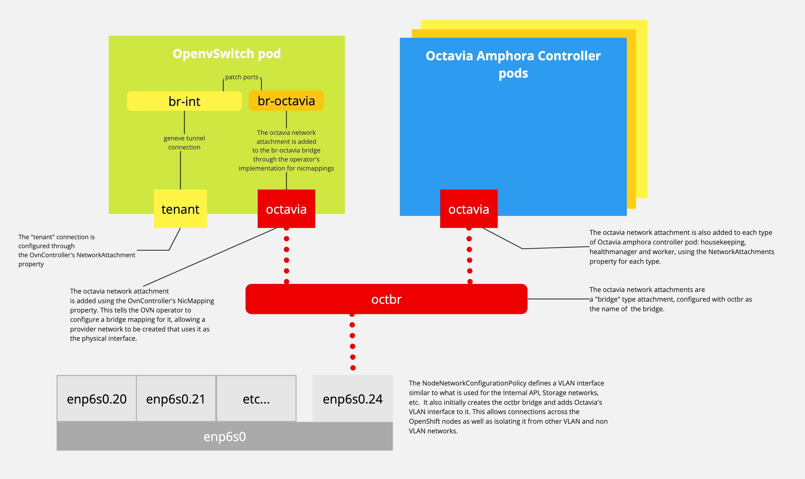

# The Octavia Amphora Management Network

The Octavia Amphora controller pods require network connectivity across the
OpenStack cloud in order to monitor and manage amphora Load Balancer VMs . This
document describes the elements that implement the management network.

The _Octavia management network_ is actually two OpenStack networks: a tenant
network that is connected to the amphora VMs; and a provider network connecting
Amphora controllers running in the podified control plane through a network
defined by a kubernetes network attachment. An OpenStack router routes packets
between the two with both the control plane pods and load balancer VMs having
routes configured to direct traffic through the router for those networks.

## Configuring Octavia's Control Plane Networking



## How To Add Octavia to an existing deployment

Adding Octavia to an existing deployment requires a L2 connection between
OpenShift worker nodes hosting the amphora controller pods and a network
attachment to give pods access to that connection as well as allow connections
between pods on a worker node. The former is configured through the
`NodeNetworkConfigurationPolicy` custom resource and the latter through a
`NetworkAttachmentDefinition` custom resource. The following provides examples
of what these CR modifications might look like. Please note the actual values
for things like `base-iface` and appropriate network IP ranges may vary
depending on hardware configuration or local networking policies, etc..

### Add the octavia interfaces to each NodeNetworkConfigurationPolicy.

This example assumes that the interface **enp6s0** is being used as the base
interface for the VLAN interfaces configured for network isolation on your
OpenShift nodes.

The vlan interface is added as a port to the `octbr` bridge to allow pods
connected to `octavia` network attachment to communicate with pods running on
other worker nodes. As it is a VLAN interface, it also provides desirable
isolation from other networks that might share the same base interface or the
physical medium that the base interface is connected to.

In general, the following interfaces must be added to each relevant
`NodeNetworkConfigurationPolicy` in the cluster.

```
        - description: Octavia vlan host interface
          name: enp6s0.24
          state: up
          type: vlan
          vlan:
            base-iface: enp6s0
            id: 24
        - bridge:
            options:
              stp:
                enabled: false
            port:
            - name: enp6s0.24
          description: Configuring bridge octbr
          mtu: 1500
          name: octbr
          state: up
          type: linux-bridge
```

This changes can be affected by editing the policy directly with `oc edit` or
by modifying the `NodeNetworkConfigurationPolicy` yaml files used for
deployment and applying `oc apply`. The edits can also be made using JSON patch
commands similar to the following:

```sh
oc get -n openstack --no-headers nncp | cut -f 1 -d ' ' | while read; do

interfaces=$(oc get nncp $REPLY -o jsonpath="{.spec.desiredState.interfaces[*].name}")

(echo $interfaces | grep -w -q "octbr|enp6s0.24") || \
        oc patch -n openstack nncp $REPLY --type json --patch '
[{
    "op": "add",
    "path": "/spec/desiredState/interfaces/-",
    "value": {
       "description": "Octavia VLAN host interface",
       "name": "enp6s0.24",
       "state": "up",
       "type": "vlan",
       "vlan": {
         "base-iface": "enp6s0",
         "id": 24
         }
    }
},
{
    "op": "add",
    "path": "/spec/desiredState/interfaces/-",
    "value": {
       "description": "Octavia Bridge",
       "mtu": 1500,
       "state": "up",
       "type": "linux-bridge",
       "name": "octbr",
       "bridge": {
         "options": { "stp": { "enabled": "false" } },
         "port": [ { "name": "enp6s0.24" } ]
         }
    }
}]'

done
```

### Add the octavia network attachment definition for the Octavia management network.

The `octavia` network attachment is needed to connect pods that manage amphorae
and the OpenvSwitch pods (managed by the OVN operator). OpenStack uses the
podified OpenvSwitch instance to implement the route between the management
network's provider and tenant networks. This attachment must be a bridgeable
interface in the OpenvSwitch pod and must permit communication among other pods
on the same node. The _bridge_ attachment type is the only type that
supports this. While the _bridge_ attachment type does not enable connectivity
across nodes on it's own, the vlan interface added to the bridge in the
_NodeNetworkConfigurationPolicy_ above creates the necessary layer 2 link.

```sh
cat >> octavia-nad.yaml << EOF_CAT
apiVersion: k8s.cni.cncf.io/v1
kind: NetworkAttachmentDefinition
metadata:
  labels:
    osp/net: octavia
  name: octavia
  namespace: openstack
spec:
  config: |
    {
      "cniVersion": "0.3.1",
      "name": "octavia",
      "type": "bridge",
      "bridge": "octbr",
      "ipam": {
        "type": "whereabouts",
        "range": "172.23.0.0/24",
        "range_start": "172.23.0.30",
        "range_end": "172.23.0.70",
        "routes": [
           {
             "dst": "172.24.0.0/16",
             "gw" : "172.23.0.150"
           }
         ]
      }
    }
EOF_CAT
oc apply -n openstack -f octavia-nad.yaml
```

### Enabling octavia

When enabling octavia, you need to configure the OVN controller to create a NIC
mapping for the `octavia` network attachment as well as add it to the
networkAttachments property for each Octavia service that controls amphorae.

```sh
# Note: please add 'octavia: octbr' to existing nicMappings if there are
# existing values. Also the name 'controlplane' may be different for your
# deployment.
oc patch  -n openstack openstackcontrolplane controlplane --type=merge --patch '
spec:
  ovn:
    template:
      ovnController:
        nicMappings:
          octavia: octbr
  octavia:
    enabled: true
    template:
      octaviaHousekeeping:
        networkAttachments:
          - octavia
      octaviaHealthManager:
        networkAttachments:
          - octavia
      octaviaWorker:
        networkAttachments:
          - octavia
'
```

When the operator is done deploying, the output of `oc get pods` should include
lines similar to the following (the actual names will vary by suffix):

```
  octavia-api-5cf9bc78f7-4lmds                                    2/2     Running     0          42h
  octavia-healthmanager-5g94j                                     1/1     Running     0          21h
  octavia-housekeeping-5gtw8                                      1/1     Running     0          21h
  octavia-image-upload-78b4b6c47c-xzdtl                           1/1     Running     0          35h
  octavia-worker-pq55m                                            1/1     Running     0          21h
```

## How the NAD Parameters Drive Network Provisioning

The operator parses the `octavia` NetworkAttachmentDefinition to derive all
Neutron network parameters. Understanding this mapping is essential for
correct configuration.

Given a NAD with the following IPAM configuration:

```json
"ipam": {
    "range": "172.23.0.0/24",
    "range_start": "172.23.0.30",
    "range_end": "172.23.0.70",
    "routes": [{ "dst": "172.24.0.0/16", "gw": "172.23.0.150" }]
}
```

The operator derives:

| Parameter | Source | Example Value |
|---|---|---|
| Provider subnet CIDR | `range` | `172.23.0.0/24` |
| Provider allocation pool start | `range_end` + 1 | `172.23.0.71` |
| Provider allocation pool end | start + 25 | `172.23.0.96` |
| Predictable IP pool start | allocation pool start + 26 | `172.23.0.97` |
| Predictable IP pool end | allocation pool start + 51 | `172.23.0.122` |
| Router gateway IP | `routes[0].gw` | `172.23.0.150` |
| Tenant subnet CIDR | `routes[0].dst` | `172.24.0.0/16` |
| Tenant allocation pool start | 5th address of CIDR | `172.24.0.5` |
| Tenant allocation pool end | 2nd-to-last address of CIDR | `172.24.255.254` |

The IP address space on the provider subnet is divided into three ranges:
1. **Pod IPs** (`range_start` to `range_end`): Allocated by whereabouts to pods
   via the NAD.
2. **Neutron allocation pool** (25 IPs after `range_end`): Used by Neutron for
   the `octavia-provider-subnet`.
3. **Predictable IPs** (25 IPs after the Neutron pool): Assigned to health
   manager and rsyslog pods (see below).

The router gateway IP (`gw`) must fall within the provider subnet CIDR but
**outside** all three ranges above. Alternatively, the gateway can be specified
via the `spec.lbMgmtNetwork.lbMgmtRouterGateway` field in the Octavia CR, which
takes precedence when there are no routes in the NAD.

## The Octavia Neutron LB Management Network

Once the octavia operator has finished deploying octavia, the details of the
management network can be examined. The results of running
`oc rsh openstackclient openstack network list -f yaml` should include
`lb-mgmt-net` and `octavia-provider-net`:

```yaml
- ID: 2e4fc309-546b-4ac8-9eae-aa8d70a27a9b
  Name: octavia-provider-net
  Subnets:
  - eea45073-6e56-47fd-9153-12f7f49bc115
- ID: 77881d3f-04b0-46cb-931f-d54003cce9f0
  Name: lb-mgmt-net
  Subnets:
  - e4ab96af-8077-4971-baa4-e0d40a16f55a
```

The `octavia-provider-net` is the external _provider_ network and uses the
`octavia` network attachment interface as the physical network. Linked to the
`octavia` network attachment. This network is limited to the OpenShift control
plane. `lb-mgmt-net` is a self-serve _tenant_ network that the connects the
Octavia amphora instances.

> The amphora controllers do not have direct access to the `lb-mgmt-net`
> network. It is accessed through the `octavia` network attachment and a router
> that the octavia-operator manages.

### Provider Network Details

The `octavia-provider-net` is created as an external network with a `flat`
network type and a physical network named `octavia`. This physical network name
corresponds to the NIC mapping configured on the OVN controller
(`nicMappings: octavia: octbr`).

The operator restricts access to this network by updating the Neutron RBAC
policy: the default rule that allows all tenants to use the external network is
changed to grant access only to the service tenant (the project that owns the
Octavia services). This prevents other tenants from creating ports on the
provider network.

The subnets can be viewed by running `oc rsh openstackclient openstack subnet list -f yaml`:

```yaml
- ID: e4ab96af-8077-4971-baa4-e0d40a16f55a
  Name: lb-mgmt-subnet
  Network: 77881d3f-04b0-46cb-931f-d54003cce9f0
  Subnet: 172.24.0.0/16
- ID: eea45073-6e56-47fd-9153-12f7f49bc115
  Name: octavia-provider-subnet
  Network: 2e4fc309-546b-4ac8-9eae-aa8d70a27a9b
  Subnet: 172.23.0.0/24
```

The subnet CIDR for `octavia-provider-subnet` is taken from the `octavia`
network attachment and the Subnet CIDR of `lb-mgmt-subnet` is taken from the
`dst` field of the `octavia` network attachment routes.

The `octavia-link-router` handles the routing between the `octavia-provider-net` and
`lb-mgmt-net` networks. To view the routers run `oc rsh openstackclient openstack router list -f yaml`:

```yaml
- ID: 371d800c-c803-4210-836b-eb468654462a
  Name: octavia-link-router
  Project: dc65b54e9cba475ba0adba7f898060f2
  State: true
  Status: ACTIVE
```

The details of the `octavia-link-router` reveal how it is configured to treat
the networks. These can be retrieved by running
`oc rsh openstackclient openstack router show -f yaml octavia-link-router`:

```yaml
admin_state_up: true
availability_zone_hints: []
availability_zones: []
created_at: '2024-06-11T17:20:57Z'
description: ''
enable_ndp_proxy: null
external_gateway_info:
  enable_snat: false
  external_fixed_ips:
  - ip_address: 172.23.0.150
    subnet_id: eea45073-6e56-47fd-9153-12f7f49bc115
  network_id: 2e4fc309-546b-4ac8-9eae-aa8d70a27a9b
flavor_id: null
id: 371d800c-c803-4210-836b-eb468654462a
interfaces_info:
- ip_address: 172.24.1.89
  port_id: 1a44e94d-f44a-4752-81db-bc5402857a08
  subnet_id: e4ab96af-8077-4971-baa4-e0d40a16f55a
name: octavia-link-router
project_id: dc65b54e9cba475ba0adba7f898060f2
revision_number: 4
routes: []
status: ACTIVE
tags: []
tenant_id: dc65b54e9cba475ba0adba7f898060f2
updated_at: '2024-06-11T17:21:01Z'
```

The `external_gateway_info` of the router will correspond to the `gw` field of
the `routes` provided in the network attachment. Also notice that source network
address translation is disabled. This is important as the amphora controllers
communicate with the amphora using the addresses on the `lb-mgmt-net` that
OpenStack allocates, not a floating IP. The `routes` of the network attachment
direct traffic from the amphora controllers to the router and the host routes on
the `lb-mgmt-net` subnet establish the reverse route. This host route will use
the `ip_address` of the port in `interfaces_info` as the next_hop and the
`Subnet` of the `octavia-provider-subnet` as the `Destination` to be routed to.

To view the host routes for the `lb-mgmt-subnet`, run `oc rsh openstackclient openstack subnet show lb-mgmt-subnet -c host_routes -f yaml`

```yaml
host_routes:
- destination: 172.23.0.0/24
  nexthop: 172.24.1.89
```

The port used to connect `lb-mgmt-subnet` to the router is named
`lb-mgmt-router-port` and the details can be viewed by running `oc rsh
openstackclient openstack port show lb-mgmt-router-port -f yaml`. Note that the
`port_id` in the router's `interface_info` can be used instead of the port name.

```yaml
admin_state_up: true
allowed_address_pairs: []
binding_host_id: ''
binding_profile: {}
binding_vif_details: {}
binding_vif_type: unbound
binding_vnic_type: normal
created_at: '2024-06-11T17:20:41Z'
data_plane_status: null
description: ''
device_id: 371d800c-c803-4210-836b-eb468654462a
device_owner: network:router_interface
device_profile: null
dns_assignment:
- fqdn: host-172-24-1-89.openstackgate.local.
  hostname: host-172-24-1-89
  ip_address: 172.24.1.89
dns_domain: ''
dns_name: ''
extra_dhcp_opts: []
fixed_ips:
- ip_address: 172.24.1.89
  subnet_id: e4ab96af-8077-4971-baa4-e0d40a16f55a
id: 1a44e94d-f44a-4752-81db-bc5402857a08
ip_allocation: immediate
mac_address: fa:16:3e:ba:be:ee
name: lb-mgmt-router-port
network_id: 77881d3f-04b0-46cb-931f-d54003cce9f0
numa_affinity_policy: null
port_security_enabled: true
project_id: dc65b54e9cba475ba0adba7f898060f2
propagate_uplink_status: null
qos_network_policy_id: null
qos_policy_id: null
resource_request: null
revision_number: 3
security_group_ids:
- 055686ce-fb2d-409b-ab74-85df9ab3a9e0
- 5c41444b-0863-4609-9335-d5a66bdbcad8
status: ACTIVE
tags: []
trunk_details: null
updated_at: '2024-06-11T17:21:03Z'
```
The `fixed_ips`, `device_id` and `device_owner` are all of interest:
* `fixed_ips` will match the IP for the `interfaces_info` of the `octavia-link-router`
* `device_id` will match the ID for the `octavia-link-router`
* `device_owner` indicates that OpenStack is using the port as a router interface

### Subnet Host Routes

The operator programmatically configures a host route on the `lb-mgmt-subnet`
so that amphora VMs know how to reach the control plane pods on the provider
network. The route's destination is the provider subnet CIDR and the next hop is
the IP address of the `lb-mgmt-router-port` on the tenant side of the router.

This is the reverse direction of the route defined in the NAD: the NAD route
tells the pods how to reach the tenant network (via the router gateway on the
provider side), and the subnet host route tells the amphorae how to reach the
provider network (via the router port on the tenant side).

## Security Groups

The operator creates four security groups to control traffic on the management
networks. Two are created in the **service tenant** (for the tenant network) and
two in the **admin tenant** (for the provider network).

### Management Security Groups

| Security Group | Rules |
|---|---|
| `lb-mgmt-sec-grp` | TCP 22 (SSH) IPv4/IPv6, TCP 9443 (amphora agent) IPv4/IPv6 |
| `lb-health-mgr-sec-grp` | UDP 5555 (heartbeat) IPv4/IPv6, UDP 514 (log offloading) IPv4/IPv6, TCP 514 (log offloading) IPv4/IPv6 |

The SSH rule allows controller access to amphorae for management. The
amphora agent port (9443) is used for TLS-secured communication between the
controllers and the amphora agent running inside each load balancer VM.

### Provider Security Groups

| Security Group | Rules |
|---|---|
| `lb-prov-sec-grp` | Same rules as `lb-mgmt-sec-grp` |
| `lb-health-prov-sec-grp` | Same rules as `lb-health-mgr-sec-grp` |

These are created in the admin tenant for the provider network side.

## Route Configuration in Amphora Controller Pods

The amphora controller pods (healthmanager, housekeeping, worker) need routes to
reach the tenant network where amphorae reside. These routes are configured at
pod startup by an init container.

### How it works

1. The operator passes the tenant subnet CIDR(s) and the router gateway IP as
   environment variables to each amphora controller pod:
   - `MGMT_CIDR`: The primary tenant subnet CIDR (e.g. `172.24.0.0/16`)
   - `MGMT_GATEWAY`: The router's IP on the provider network (e.g. `172.23.0.150`)
   - `MGMT_CIDR0`, `MGMT_CIDR1`, ...: Additional CIDRs for availability
     zone-specific tenant subnets

2. An init container runs with `NET_ADMIN` and `SYS_ADMIN` capabilities. It
   executes a Python script (`octavia_mgmt_subnet_route.py`) that uses
   `pyroute2` to add a route on the `octavia` network interface:

   ```
   ip route add <MGMT_CIDR> via <MGMT_GATEWAY> dev octavia
   ```

3. This is repeated for each extra CIDR (`MGMT_CIDR0`, `MGMT_CIDR1`, etc.)
   when availability zones are configured.

These routes ensure that traffic from the controller pods destined for amphora
VMs on the tenant network is directed through the `octavia-link-router`.

## Predictable IP Allocation for Health Manager and Rsyslog Pods

The health manager pods need stable, well-known IP addresses on the provider
network so that amphora VMs can send heartbeat messages to them. Similarly,
rsyslog pods need stable IPs for log forwarding. The operator implements a
"predictable IP" allocation scheme to achieve this.

### IP Range Allocation

A pool of 25 IP addresses is reserved on the provider subnet, starting
immediately after the Neutron allocation pool (which itself starts after the NAD
`range_end`). Using the example NAD values:

```
NAD range_end:              172.23.0.70
Neutron pool:               172.23.0.71 - 172.23.0.96   (25 IPs)
Predictable IP pool:        172.23.0.97 - 172.23.0.122  (25 IPs)
```

### Allocation Mechanism

1. The operator lists all Kubernetes nodes matching the configured `nodeSelector`
   (or all nodes if no selector is set).
2. For each node, it allocates one IP for the health manager (`hm_<node-name>`)
   and one for rsyslog (`rsyslog_<node-name>`).
3. Allocations are stored in a ConfigMap named `octavia-hm-ports`. Existing
   allocations are preserved across reconciliation loops to maintain IP
   stability.

### Pod IP Configuration

When a health manager pod starts on a given node:

1. The init container reads the node name from the `NODE_NAME` environment
   variable (sourced from the downward API).
2. It looks up `hm_<node-name>` in the `octavia-hm-ports` ConfigMap (mounted at
   `/var/lib/hmports/`).
3. A Python script (`setipalias.py`) uses `pyroute2` to add the predictable IP
   as an alias on the `octavia` network interface (with a /32 mask for IPv4 or
   /128 for IPv6).
4. Another script (`octavia_hm_advertisement.py`) sends gratuitous ARP (or
   equivalent IPv6 neighbor advertisement) for the alias IP so that the network
   learns the new address immediately.

### How Octavia Uses These IPs

The predictable IPs are collected from the ConfigMap and written into the
`octavia.conf` configuration file:

```ini
[health_manager]
controller_ip_port_list=172.23.0.97:5555,172.23.0.98:5555,...
```

Each amphora sends periodic heartbeat messages (UDP port 5555) to every IP in
this list, which is how the health manager monitors amphora liveness.

Similarly, rsyslog IPs populate the log target configuration:

```ini
[amphora_agent]
admin_log_targets=172.23.0.99:514,172.23.0.100:514,...
tenant_log_targets=172.23.0.99:514,172.23.0.100:514,...
```

## Amphora Boot Network and Security Configuration

When the operator provisions Octavia's configuration, it populates the
`octavia.conf` template with the Neutron resource IDs discovered or created
during management network setup:

```ini
[controller_worker]
amp_boot_network_list=<lb-mgmt-net network ID>
amp_secgroup_list=<lb-mgmt-sec-grp security group ID>
amp_image_tag=amphora-image
amp_ssh_key_name=octavia-ssh-key
```

- `amp_boot_network_list` is set to the `lb-mgmt-net` tenant network ID, which
  is the network where new amphora VMs are booted.
- `amp_secgroup_list` references the `lb-mgmt-sec-grp` security group, applied
  to each amphora's port.
- `amp_image_tag` is used to find the amphora image in Glance by tag.
- `amp_ssh_key_name` references the Nova keypair used for SSH access to
  amphorae.

## Unmanaged Management Networks (`manageLbMgmtNetworks: false`)

By default, the operator creates and manages all Neutron resources for the
management network. However, in environments where the networking resources are
pre-created or managed externally, the operator can be configured to discover
existing resources instead.

Setting `spec.lbMgmtNetwork.manageLbMgmtNetworks` to `false` in the Octavia CR
causes the operator to query Neutron for existing resources by their well-known
names (`lb-mgmt-net`, `lb-mgmt-subnet`, `octavia-link-router`,
`lb-mgmt-sec-grp`) rather than creating them. The operator will still read the
NAD for route information and configure pod routes and predictable IPs as
normal.

This mode is useful when:
- Networking resources are managed by a separate automation tool.
- Custom network topologies are required that differ from the operator's
  defaults.
- The management network was pre-created during an initial deployment and should
  not be modified.

## Availability Zone Support

The operator supports creating per-availability-zone management networks for
deployments that span multiple AZs (e.g. DCN/edge deployments).

### Configuration

The `spec.lbMgmtNetwork` section of the Octavia CR accepts:

- `availabilityZones`: A list of availability zone names for Neutron resource
  placement.
- `availabilityZoneCIDRs`: A map of availability zone names to CIDRs (e.g.
  `{"az1": "172.34.0.0/24", "az2": "172.35.0.0/24"}`).
- `createDefaultLbMgmtNetwork`: When `false`, skips creating the default
  (non-AZ) `lb-mgmt-net`. Useful in DCN mode where only AZ-specific networks
  are needed.

### Resources Created Per AZ

For each availability zone with a configured CIDR, the operator creates:

- A tenant network: `lb-mgmt-<az>-net`
- A tenant subnet: `lb-mgmt-<az>-subnet` (with the AZ-specific CIDR)
- A router port: `lb-mgmt-<az>-router-port` (connected to the shared
  `octavia-link-router`)
- Host routes on the AZ subnet pointing to the provider network via the
  AZ-specific router port

All AZ networks share the same `octavia-link-router` and
`octavia-provider-net`. The extra CIDRs are passed to controller pods as
`MGMT_CIDR0`, `MGMT_CIDR1`, etc., so routes are added for each AZ's tenant
subnet.

## Running the Octavia Amphora Controller Pods on specific Nodes

By default, the Amphora Controller pods are deployed on all the nodes of a
cluster. In case of a cluster with a high number of nodes, it's not needed,
it's preferable to use only 3 nodes.
An admin can limit the number of instances of these services by using
a `nodeSelector`. They add a label on specific nodes to indicate that they will
host the Octavia services.

For instance, set a label on master-2:

```shell
$ oc patch nodes master-2 --type merge --patch '{"metadata":{"labels":{"openstack.org/octavia-controller":""}}}'
```

Make the Octavia services run only on these nodes:

```shell
$ oc patch -n openstack openstackcontrolplane controlplane --type merge --patch '{"spec":{"octavia":{"template":{"nodeSelector":{"openstack.org/octavia-controller":""}}}}}'
```
